# T0 Architecture Guide Implementation Plan

> **For agentic workers:** REQUIRED SUB-SKILL: Use superpowers:subagent-driven-development (recommended) or superpowers:executing-plans to implement this plan task-by-task. Steps use checkbox (`- [ ]`) syntax for tracking.

**Goal:** Build a single self-contained interactive HTML file at `docs/superpowers/t0-architecture-guide.html` that explains T0 architecture and code end-to-end across 6 chapters with 15 Mermaid diagrams and annotated code excerpts. Conforms to the spec at `docs/superpowers/specs/2026-05-07-t0-architecture-guide-design.md`.

**Architecture:** One HTML file with all CSS in a `<style>` block, vanilla JS for TOC scrollspy and the optional dark-mode toggle, Mermaid via CDN for diagrams, Prism.js via CDN for syntax-highlighted code. Acceptance is enforced by a Python verification script (`docs/superpowers/scripts/verify_guide.py`) that the chapter implementation tasks must pass — written first, TDD-style. Code excerpts are tagged with `<!-- excerpt: PATH:M-N -->` HTML comments so the verifier can confirm the cited file actually has those lines.

**Tech Stack:** HTML/CSS/vanilla JS · Mermaid 11 (CDN: `https://cdn.jsdelivr.net/npm/mermaid@11/dist/mermaid.esm.min.mjs`) · Prism.js 1.29 (CDN) · Python 3 (verification + an excerpt-extraction helper) · git

---

## File Structure

**Created by this plan (writable):**

| Path | Purpose |
| --- | --- |
| `docs/superpowers/t0-architecture-guide.html` | The deliverable artifact. One file, grows chapter by chapter. |
| `docs/superpowers/scripts/verify_guide.py` | Acceptance harness. Validates chapter shape, diagram count, excerpt references, TOC anchors. |
| `docs/superpowers/scripts/extract_excerpt.py` | Helper. Given `path:M-N`, prints the file's lines M through N for paste-in. Useful while writing chapters. |
| `docs/superpowers/scripts/test_verify_guide.py` | Unit tests for the verifier (TDD before the verifier itself). |

**Read-only (sources for content):**

- `CLAUDE.md` (top-of-tree, big-picture grounding)
- `src/python/T0/__init__.py`
- `src/python/T0/RunConfig/Tier0Config.py`, `RunConfigAPI.py`
- `src/python/T0Component/Tier0Feeder/{Tier0Feeder.py,Tier0FeederPoller.py}` and `MultipleAgents/{BaseAgent.py,MainAgent.py,HelperAgent.py}`
- `src/python/T0/JobSplitting/{Repack.py,RepackMerge.py,Express.py,ExpressMerge.py,Condition.py,AlcaHarvest.py}`
- `src/python/T0/RunLumiCloseout/RunLumiCloseoutAPI.py`
- `src/python/T0/ConditionUpload/{ConditionUploadAPI.py,upload.py}`
- `src/python/T0/WMBS/Oracle/Tier0Feeder/`, `RunConfig/`, `JobSplitting/`, `RunLumiCloseout/`, `ConditionUpload/`, plus `Create.py`
- `etc/ReplayOfflineConfiguration.py`
- `bin/00_pypi_deploy_replay.sh`, `00_pypi_deploy_prod.sh`, `00_pypi_start_agent.sh`, `00_pypi_stop_agent.sh`, `00_pypi_patches.sh`, `pypi_update.sh`, `bin/t0`
- `.github/workflows/{deployReplayPR.yaml,validate-config.yaml,create_tag_and_release.yaml,pypi_build_publish_template.yaml}`

## Conventions used in every chapter task

1. The chapter is one HTML `<section id="chapter-N">` block, appended to `<main>` of the guide.
2. Inside, six required subsection IDs in order: `ch{N}-setup`, `ch{N}-diagrams`, `ch{N}-code`, `ch{N}-deeper-dive`, `ch{N}-takeaways`, `ch{N}-self-check`. The verifier requires all six.
3. Every code excerpt is preceded by `<!-- excerpt: PATH:M-N -->`. The verifier confirms `PATH` exists and has at least `N` lines (relative to repo root).
4. Each diagram is a `<pre class="mermaid">…</pre>` block. The verifier counts ≥ 15 in total and ≥ 1 per chapter.
5. Each chapter ends with 3–5 self-check questions in a `<ol>` inside `#ch{N}-self-check`. No answer key (per spec).
6. The first child of `#ch{N}-setup` is a `<p class="meta">~Xh reading time</p>` line, where X is the chapter's estimated duration. Use **5h** for chapters 1, 2, 4, 5; **6h** for chapters 3, 6.
7. Each chapter is one commit.

## Tasks

---

### Task 0: Project skeleton and empty deliverable

**Files:**
- Create: `docs/superpowers/t0-architecture-guide.html`
- Create: `docs/superpowers/scripts/.gitkeep`

- [ ] **Step 1: Create the empty guide file**

Write this exact content to `docs/superpowers/t0-architecture-guide.html`:

```html
<!doctype html>
<html lang="en">
<head><meta charset="utf-8"><title>T0 Architecture Guide (placeholder)</title></head>
<body><p>Placeholder. Chapters will be added by the implementation plan.</p></body>
</html>
```

- [ ] **Step 2: Create scripts dir keepfile**

```bash
touch docs/superpowers/scripts/.gitkeep
```

- [ ] **Step 3: Commit**

```bash
git add docs/superpowers/t0-architecture-guide.html docs/superpowers/scripts/.gitkeep
git commit -m "Scaffold empty T0 architecture guide"
```

---

### Task 1: Code-excerpt extractor helper

**Files:**
- Create: `docs/superpowers/scripts/extract_excerpt.py`

This is a small utility used by the human/agent writing chapters. It takes `path:M-N` on the command line and prints exactly those lines, prefixed with line numbers, ready to be pasted into the HTML.

- [ ] **Step 1: Write the helper**

Write this exact content to `docs/superpowers/scripts/extract_excerpt.py`:

```python
#!/usr/bin/env python3
"""Print a `path:start-end` excerpt from the repo, with line numbers.

Usage:
    python docs/superpowers/scripts/extract_excerpt.py src/python/T0/__init__.py:1-8
"""
from __future__ import annotations
import sys
from pathlib import Path

REPO_ROOT = Path(__file__).resolve().parents[3]


def parse_ref(ref: str) -> tuple[Path, int, int]:
    if ":" not in ref:
        raise SystemExit(f"Bad ref {ref!r}; expected PATH:START-END or PATH:N")
    path_str, lines = ref.split(":", 1)
    if "-" in lines:
        start_s, end_s = lines.split("-", 1)
        start, end = int(start_s), int(end_s)
    else:
        start = end = int(lines)
    return REPO_ROOT / path_str, start, end


def main(argv: list[str]) -> int:
    if len(argv) != 2:
        print(__doc__, file=sys.stderr)
        return 2
    path, start, end = parse_ref(argv[1])
    if not path.exists():
        raise SystemExit(f"File not found: {path}")
    with path.open() as fh:
        lines = fh.readlines()
    if end > len(lines):
        raise SystemExit(f"{path} only has {len(lines)} lines; requested up to {end}")
    width = len(str(end))
    for i, line in enumerate(lines[start - 1 : end], start=start):
        print(f"{i:>{width}}  {line.rstrip()}")
    return 0


if __name__ == "__main__":
    sys.exit(main(sys.argv))
```

- [ ] **Step 2: Smoke-test it**

Run: `python3 docs/superpowers/scripts/extract_excerpt.py src/python/T0/__init__.py:1-8`

Expected output (line numbers may render with leading spaces):

```
1  """
2  _T0_
3
4  Core libraries for Workload Management Packages
5
6  """
7  __version__ = '3.5.5'
8  __all__ = []
```

- [ ] **Step 3: Commit**

```bash
git add docs/superpowers/scripts/extract_excerpt.py
git commit -m "Add code-excerpt extractor helper for guide authoring"
```

---

### Task 2: Verification harness — tests first, then script (TDD)

**Files:**
- Create: `docs/superpowers/scripts/test_verify_guide.py`
- Create: `docs/superpowers/scripts/verify_guide.py`

Plan: write the tests against the still-nonexistent `verify_guide` module first; confirm they fail; then implement `verify_guide.py` until all tests pass.

- [ ] **Step 1: Write the tests**

Write this exact content to `docs/superpowers/scripts/test_verify_guide.py`:

```python
"""Unit tests for verify_guide.py."""
from __future__ import annotations
import sys
import textwrap
import unittest
from pathlib import Path

HERE = Path(__file__).resolve().parent
sys.path.insert(0, str(HERE))

import verify_guide as vg  # noqa: E402


def chapter_block(n: int, *, sections: list[str] | None = None,
                  diagrams: int = 1, excerpts: list[str] | None = None) -> str:
    if sections is None:
        sections = ["setup", "diagrams", "code", "deeper-dive", "takeaways", "self-check"]
    parts = [f'<section id="chapter-{n}"><h2>Chapter {n}</h2>']
    for s in sections:
        parts.append(f'<div id="ch{n}-{s}">x</div>')
    for _ in range(diagrams):
        parts.append('<pre class="mermaid">graph LR; a-->b;</pre>')
    for ref in excerpts or []:
        parts.append(f'<!-- excerpt: {ref} --><pre><code>x</code></pre>')
    parts.append('</section>')
    return "\n".join(parts)


def make_guide(chapters: int = 6, **kwargs) -> str:
    nav_links = "".join(f'<a href="#chapter-{n}">Ch {n}</a>' for n in range(1, chapters + 1))
    body = "".join(chapter_block(n, **kwargs) for n in range(1, chapters + 1))
    return textwrap.dedent(f"""\
        <!doctype html><html><body>
        <nav class="toc">{nav_links}</nav>
        <main>{body}</main>
        </body></html>
    """)


class CheckChapterCount(unittest.TestCase):
    def test_all_six_present(self) -> None:
        self.assertEqual(vg.check_chapter_count(make_guide()), [])

    def test_missing_chapter(self) -> None:
        html = make_guide(chapters=5)
        issues = vg.check_chapter_count(html)
        self.assertTrue(any("expected 1..6" in i for i in issues), issues)


class CheckChapterSections(unittest.TestCase):
    def test_all_sections_present(self) -> None:
        self.assertEqual(vg.check_chapter_sections(make_guide(diagrams=3)), [])

    def test_missing_section(self) -> None:
        html = make_guide(sections=["setup", "diagrams", "code", "takeaways", "self-check"])
        issues = vg.check_chapter_sections(html)
        self.assertTrue(any("deeper-dive" in i for i in issues), issues)


class CheckDiagramCount(unittest.TestCase):
    def test_enough_diagrams(self) -> None:
        # 6 chapters * 3 diagrams = 18 ≥ 15
        self.assertEqual(vg.check_diagram_count(make_guide(diagrams=3)), [])

    def test_too_few_diagrams(self) -> None:
        # 6 chapters * 1 diagram = 6 < 15
        issues = vg.check_diagram_count(make_guide(diagrams=1))
        self.assertEqual(len(issues), 1)
        self.assertIn("at least 15", issues[0])


class CheckExcerptRefs(unittest.TestCase):
    def test_valid_excerpt(self) -> None:
        # src/python/T0/__init__.py exists at the repo root and has 9 lines.
        html = '<!-- excerpt: src/python/T0/__init__.py:1-5 --><pre><code>x</code></pre>'
        self.assertEqual(vg.check_excerpt_refs(html), [])

    def test_missing_file(self) -> None:
        html = '<!-- excerpt: src/python/T0/does_not_exist.py:1-5 --><pre><code>x</code></pre>'
        self.assertTrue(vg.check_excerpt_refs(html))

    def test_line_out_of_range(self) -> None:
        html = '<!-- excerpt: src/python/T0/__init__.py:1-9999 --><pre><code>x</code></pre>'
        issues = vg.check_excerpt_refs(html)
        self.assertTrue(any("exceeds file" in i for i in issues), issues)


class CheckTocAnchors(unittest.TestCase):
    def test_all_resolve(self) -> None:
        self.assertEqual(vg.check_toc_anchors(make_guide()), [])

    def test_dangling_link(self) -> None:
        html = make_guide().replace('href="#chapter-3"', 'href="#chapter-99"')
        issues = vg.check_toc_anchors(html)
        self.assertTrue(any("chapter-99" in i for i in issues), issues)


if __name__ == "__main__":
    unittest.main()
```

- [ ] **Step 2: Run the tests; expect ImportError because verify_guide.py does not exist yet**

Run: `python3 -m unittest docs.superpowers.scripts.test_verify_guide`

Expected: `ModuleNotFoundError: No module named 'verify_guide'` (or similar).

- [ ] **Step 3: Write the verification script**

Write this exact content to `docs/superpowers/scripts/verify_guide.py`:

```python
#!/usr/bin/env python3
"""Verify the T0 Architecture Guide HTML artifact meets acceptance criteria."""
from __future__ import annotations
import re
import sys
from pathlib import Path

REPO_ROOT = Path(__file__).resolve().parents[3]
GUIDE_PATH = REPO_ROOT / "docs/superpowers/t0-architecture-guide.html"

REQUIRED_CHAPTERS = 6
REQUIRED_DIAGRAMS = 15
CHAPTER_SUBSECTIONS = ["setup", "diagrams", "code", "deeper-dive", "takeaways", "self-check"]


def check_chapter_count(html: str) -> list[str]:
    found = sorted(int(m) for m in re.findall(r'<section[^>]*id="chapter-(\d+)"', html))
    if found != list(range(1, REQUIRED_CHAPTERS + 1)):
        return [f"Chapters found: {found}, expected 1..{REQUIRED_CHAPTERS}"]
    return []


def check_chapter_sections(html: str) -> list[str]:
    issues: list[str] = []
    for n in range(1, REQUIRED_CHAPTERS + 1):
        m = re.search(
            rf'<section[^>]*id="chapter-{n}"(.*?)(?=<section[^>]*id="chapter-|</main)',
            html, re.DOTALL,
        )
        if not m:
            issues.append(f"Chapter {n}: section not found")
            continue
        body = m.group(1)
        for sub in CHAPTER_SUBSECTIONS:
            if not re.search(rf'id="ch{n}-{re.escape(sub)}"', body):
                issues.append(f"Chapter {n}: missing subsection id ch{n}-{sub}")
        if not re.search(r'<pre class="mermaid">', body):
            issues.append(f"Chapter {n}: contains no mermaid diagram")
    return issues


def check_diagram_count(html: str) -> list[str]:
    n = len(re.findall(r'<pre class="mermaid">', html))
    if n < REQUIRED_DIAGRAMS:
        return [f"Found {n} mermaid blocks; need at least {REQUIRED_DIAGRAMS}"]
    return []


def check_excerpt_refs(html: str) -> list[str]:
    issues: list[str] = []
    pattern = re.compile(r'<!--\s*excerpt:\s*([^:\s]+):(\d+)(?:-(\d+))?\s*-->')
    for m in pattern.finditer(html):
        path_str, start_s, end_s = m.group(1), m.group(2), m.group(3)
        end = int(end_s) if end_s else int(start_s)
        full = REPO_ROOT / path_str
        if not full.exists():
            issues.append(f"Excerpt source missing: {path_str}")
            continue
        line_count = sum(1 for _ in full.open())
        if end > line_count:
            issues.append(
                f"Excerpt {path_str}:{start_s}-{end} exceeds file (only {line_count} lines)"
            )
    return issues


def check_toc_anchors(html: str) -> list[str]:
    nav_match = re.search(
        r'<nav[^>]*class="[^"]*\btoc\b[^"]*"[^>]*>(.*?)</nav>', html, re.DOTALL
    )
    if not nav_match:
        return ["TOC nav not found"]
    referenced = set(re.findall(r'href="#([^"]+)"', nav_match.group(1)))
    defined = set(re.findall(r'id="([^"]+)"', html))
    missing = referenced - defined
    return [f"TOC link target missing: #{a}" for a in sorted(missing)]


CHECKS = (
    check_chapter_count,
    check_chapter_sections,
    check_diagram_count,
    check_excerpt_refs,
    check_toc_anchors,
)


def main() -> int:
    if not GUIDE_PATH.exists():
        print(f"FAIL: guide not found at {GUIDE_PATH}")
        return 1
    html = GUIDE_PATH.read_text()
    issues: list[str] = []
    for check in CHECKS:
        issues.extend(check(html))
    if issues:
        for issue in issues:
            print(f"  FAIL: {issue}")
        return 1
    print("OK: guide passes all checks")
    return 0


if __name__ == "__main__":
    sys.exit(main())
```

- [ ] **Step 4: Run the tests; expect all pass**

Run: `python3 -m unittest discover -s docs/superpowers/scripts -p 'test_verify_guide.py' -v`

Expected: 9 tests pass.

- [ ] **Step 5: Run the verifier against the placeholder HTML; expect failures (this is good — it proves the verifier detects an empty guide)**

Run: `python3 docs/superpowers/scripts/verify_guide.py`
Expected: exit 1, with "Chapters found: []" among the failures.

- [ ] **Step 6: Commit**

```bash
git add docs/superpowers/scripts/verify_guide.py docs/superpowers/scripts/test_verify_guide.py
git commit -m "Add T0 guide acceptance verifier (TDD)"
```

---

### Task 3: HTML scaffold — head, theme CSS, sidebar nav, six empty chapter sections

**Files:**
- Modify: `docs/superpowers/t0-architecture-guide.html` (replace placeholder)

This task replaces the placeholder with the full scaffold: dark-friendly theme, sticky TOC sidebar with scrollspy, Mermaid + Prism CDN, the layout grid, and six empty chapter `<section>` elements each containing the six required subsection placeholders. After this task, the verifier should fail only on the diagram-count check (since chapters exist but each has 0 diagrams).

- [ ] **Step 1: Replace the placeholder with the scaffold**

Write this exact content to `docs/superpowers/t0-architecture-guide.html`:

```html
<!doctype html>
<html lang="en">
<head>
<meta charset="utf-8">
<meta name="viewport" content="width=device-width,initial-scale=1">
<title>T0 Architecture Guide</title>
<link rel="stylesheet" href="https://cdn.jsdelivr.net/npm/prismjs@1.29.0/themes/prism-tomorrow.min.css">
<style>
  :root {
    --bg: #0d1117; --fg: #c9d1d9; --muted: #8b949e;
    --accent: #58a6ff; --rule: #30363d; --code-bg: #161b22;
    --max: 880px; --nav-w: 280px;
    --font: -apple-system, BlinkMacSystemFont, "Segoe UI", Roboto, sans-serif;
    --mono: "SF Mono", Menlo, Consolas, monospace;
  }
  html, body { background: var(--bg); color: var(--fg); }
  body { font: 16px/1.6 var(--font); margin: 0; }
  a { color: var(--accent); }
  code, pre { font-family: var(--mono); }
  pre { background: var(--code-bg); padding: 12px 16px; border-radius: 6px; overflow-x: auto; }
  .layout { display: grid; grid-template-columns: var(--nav-w) 1fr; gap: 32px; max-width: 1280px; margin: 0 auto; padding: 24px; }
  nav.toc { position: sticky; top: 24px; align-self: start; max-height: calc(100vh - 48px); overflow-y: auto; border-right: 1px solid var(--rule); padding-right: 16px; font-size: 14px; }
  nav.toc ol { list-style: none; padding: 0; margin: 0; }
  nav.toc li { margin: 4px 0; }
  nav.toc li.l2 { margin-left: 16px; color: var(--muted); }
  nav.toc a { text-decoration: none; }
  nav.toc a.active { font-weight: 600; color: var(--fg); }
  main { max-width: var(--max); }
  main h1 { font-size: 28px; border-bottom: 1px solid var(--rule); padding-bottom: 8px; }
  main h2 { font-size: 22px; margin-top: 56px; padding-top: 16px; border-top: 1px solid var(--rule); }
  main h3 { font-size: 17px; margin-top: 32px; color: var(--muted); }
  .meta { color: var(--muted); font-size: 14px; margin: -8px 0 24px; }
  .excerpt-head { color: var(--muted); font-size: 13px; font-family: var(--mono); margin: 16px 0 4px; }
  details { margin: 16px 0; padding: 12px 16px; background: var(--code-bg); border-radius: 6px; }
  summary { cursor: pointer; font-weight: 600; }
  ol.self-check { padding-left: 20px; }
  ol.self-check li { margin: 8px 0; }
  pre.mermaid { background: #f6f8fa; color: #24292f; padding: 16px; }
  .caption { color: var(--muted); font-size: 14px; margin-top: 4px; }
</style>
</head>
<body>
<div class="layout">
<nav class="toc" aria-label="Table of contents">
  <ol>
    <li><a href="#top">T0 Architecture Guide</a></li>
    <li><a href="#chapter-1">Ch 1 · Foundations</a></li>
    <li><a href="#chapter-2">Ch 2 · The Tier0Config DSL</a></li>
    <li><a href="#chapter-3">Ch 3 · The Tier0Feeder heartbeat</a></li>
    <li><a href="#chapter-4">Ch 4 · JobSplitting</a></li>
    <li><a href="#chapter-5">Ch 5 · Closeout</a></li>
    <li><a href="#chapter-6">Ch 6 · Operator surface &amp; recap</a></li>
  </ol>
</nav>
<main id="top">
  <h1>T0 Architecture Guide</h1>
  <p class="meta">A self-contained tour of the CMS Tier-0 codebase. Read top to bottom, ~5 hours per chapter.</p>

  <section id="chapter-1"><h2>Chapter 1 · Foundations</h2>
    <div id="ch1-setup"></div><div id="ch1-diagrams"></div><div id="ch1-code"></div>
    <div id="ch1-deeper-dive"></div><div id="ch1-takeaways"></div><div id="ch1-self-check"></div>
  </section>
  <section id="chapter-2"><h2>Chapter 2 · The Tier0Config DSL</h2>
    <div id="ch2-setup"></div><div id="ch2-diagrams"></div><div id="ch2-code"></div>
    <div id="ch2-deeper-dive"></div><div id="ch2-takeaways"></div><div id="ch2-self-check"></div>
  </section>
  <section id="chapter-3"><h2>Chapter 3 · The Tier0Feeder heartbeat</h2>
    <div id="ch3-setup"></div><div id="ch3-diagrams"></div><div id="ch3-code"></div>
    <div id="ch3-deeper-dive"></div><div id="ch3-takeaways"></div><div id="ch3-self-check"></div>
  </section>
  <section id="chapter-4"><h2>Chapter 4 · JobSplitting</h2>
    <div id="ch4-setup"></div><div id="ch4-diagrams"></div><div id="ch4-code"></div>
    <div id="ch4-deeper-dive"></div><div id="ch4-takeaways"></div><div id="ch4-self-check"></div>
  </section>
  <section id="chapter-5"><h2>Chapter 5 · Closeout</h2>
    <div id="ch5-setup"></div><div id="ch5-diagrams"></div><div id="ch5-code"></div>
    <div id="ch5-deeper-dive"></div><div id="ch5-takeaways"></div><div id="ch5-self-check"></div>
  </section>
  <section id="chapter-6"><h2>Chapter 6 · Operator surface and recap</h2>
    <div id="ch6-setup"></div><div id="ch6-diagrams"></div><div id="ch6-code"></div>
    <div id="ch6-deeper-dive"></div><div id="ch6-takeaways"></div><div id="ch6-self-check"></div>
  </section>
</main>
</div>

<script type="module">
  import mermaid from "https://cdn.jsdelivr.net/npm/mermaid@11/dist/mermaid.esm.min.mjs";
  mermaid.initialize({ startOnLoad: true, theme: "neutral", securityLevel: "loose" });
</script>
<script src="https://cdn.jsdelivr.net/npm/prismjs@1.29.0/components/prism-core.min.js"></script>
<script src="https://cdn.jsdelivr.net/npm/prismjs@1.29.0/plugins/autoloader/prism-autoloader.min.js"></script>
<script>
  // Scrollspy: highlight the TOC link nearest the top of the viewport.
  const links = [...document.querySelectorAll('nav.toc a')];
  const targets = links.map(a => document.querySelector(a.getAttribute('href'))).filter(Boolean);
  const obs = new IntersectionObserver(entries => {
    for (const e of entries) {
      if (!e.isIntersecting) continue;
      links.forEach(a => a.classList.toggle('active', a.getAttribute('href') === '#' + e.target.id));
    }
  }, { rootMargin: '0px 0px -70% 0px', threshold: 0 });
  targets.forEach(t => obs.observe(t));
</script>
</body>
</html>
```

- [ ] **Step 2: Run the verifier; expect failures only on diagram count**

Run: `python3 docs/superpowers/scripts/verify_guide.py`

Expected output (in some order, but exactly these failures):
```
  FAIL: Chapter 1: contains no mermaid diagram
  FAIL: Chapter 2: contains no mermaid diagram
  FAIL: Chapter 3: contains no mermaid diagram
  FAIL: Chapter 4: contains no mermaid diagram
  FAIL: Chapter 5: contains no mermaid diagram
  FAIL: Chapter 6: contains no mermaid diagram
  FAIL: Found 0 mermaid blocks; need at least 15
```

If any *other* failures appear (TOC anchors missing, chapter section IDs missing), fix the scaffold before continuing.

- [ ] **Step 3: Open the HTML in a browser to confirm the layout renders**

Open `docs/superpowers/t0-architecture-guide.html` in your browser. You should see: a dark page, a TOC sidebar with 7 links, six empty chapter headings as you scroll, and no console errors. If the TOC scrollspy doesn't activate as you scroll, check the browser console for module-loading errors.

- [ ] **Step 4: Commit**

```bash
git add docs/superpowers/t0-architecture-guide.html
git commit -m "Scaffold guide: theme, TOC sidebar, six empty chapters"
```

---

## Chapter task template (Tasks 4–9 follow this shape)

Each chapter task replaces the six empty `<div id="ch{N}-…">` blocks for one chapter with real content. The shape below is the same for every chapter; the chapter-specific instructions list **which sources to read**, **which diagrams to draw (with full Mermaid source provided)**, **which excerpts to include**, and **what the prose must cover**.

**Standard steps inside any chapter task:**

1. **Read the listed sources.** Use `python3 docs/superpowers/scripts/extract_excerpt.py PATH:M-N` for any excerpt you intend to embed. Do not freehand — copy-paste from the helper output to avoid drift.
2. **Replace `<div id="ch{N}-setup"></div>`** with `<div id="ch{N}-setup"><h3>Setup</h3>…200-400 word prose…</div>`. The prose framing is supplied below per chapter.
3. **Replace `<div id="ch{N}-diagrams"></div>`** with `<div id="ch{N}-diagrams"><h3>Diagrams</h3>…three `<pre class="mermaid">` blocks, each followed by a `<p class="caption">` of 100–200 words…</div>`. Mermaid sources are supplied below.
4. **Replace `<div id="ch{N}-code"></div>`** with `<div id="ch{N}-code"><h3>Annotated code</h3>…</div>`. Each excerpt block follows this exact pattern:

   ```html
   <p class="excerpt-head">src/python/T0/__init__.py:1-9</p>
   <!-- excerpt: src/python/T0/__init__.py:1-9 -->
   <pre><code class="language-python">…actual file content…</code></pre>
   <p>Annotation explaining what the excerpt does and why it matters in this chapter.</p>
   ```

5. **Replace `<div id="ch{N}-deeper-dive"></div>`** with `<div id="ch{N}-deeper-dive"><h3>Deeper dive</h3><details><summary>…</summary>…</details></div>`. At least one `<details>` block with optional advanced material.
6. **Replace `<div id="ch{N}-takeaways"></div>`** with `<div id="ch{N}-takeaways"><h3>Key takeaways</h3><ul>…3–6 bullets…</ul></div>`.
7. **Replace `<div id="ch{N}-self-check"></div>`** with `<div id="ch{N}-self-check"><h3>Self-check</h3><ol class="self-check">…3–5 `<li>` questions…</ol></div>`.
8. **Run** `python3 docs/superpowers/scripts/verify_guide.py`. Expected: the failures specific to this chapter are gone. Diagram count failure remains until the final chapter.
9. **Open in browser**, scroll to this chapter, confirm diagrams render and code excerpts highlight. Check the browser console for errors.
10. **Commit**: `git add docs/superpowers/t0-architecture-guide.html && git commit -m "Guide: write chapter N — <title>"`.

---

### Task 4: Chapter 1 — Foundations

**Files:**
- Modify: `docs/superpowers/t0-architecture-guide.html` (Chapter 1 sections only)

**Sources to read:**
- `CLAUDE.md` (whole file — this is the canonical big-picture reference)
- `src/python/T0/__init__.py` (9 lines)
- `src/python/T0Component/Tier0Feeder/Tier0Feeder.py` (full, ~50 lines)
- `src/python/T0Component/Tier0Feeder/Tier0FeederPoller.py:1-110` (constructor and DB-topology setup)

**Setup prose (~300 words) must cover:**
- LHC → CMS detector → DAQ → online Storage Manager → Tier-0 in plain English. Define: streamer file, run, lumi-section, stream, dataset, primary dataset.
- What "Tier-0" means as a deployment (the cmst0 user, vocms* hosts, the `/data/tier0/` layout — concept only, no commands).
- Two source roots: `src/python/T0/` (libraries) vs `src/python/T0Component/` (WMAgent harness components). Why the split exists.
- The chain in one sentence: Storage Manager → Repack → Express → PromptReco → AlcaHarvest → ConditionUpload.

**Diagrams (Mermaid sources):**

- [ ] **D1.1 — The CMS data flow at 30,000 ft**

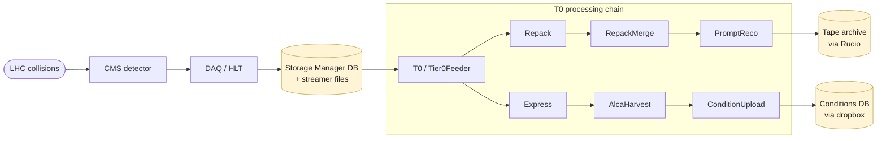

Caption (~150 words): explain that this is the whole story; everything else in the guide is detail filling in arrows and boxes; flag that the guide treats everything *to the left of* "T0" as black-box input.

- [ ] **D1.2 — WMAgent harness anatomy**

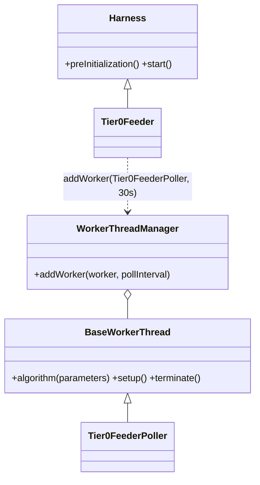

Caption (~150 words): emphasise the two-layer pattern (component/wrapper subclassing `Harness` + the *actual work* in a `BaseWorkerThread` subclass), and that this is a generic WMCore pattern reused by every WMAgent component.

- [ ] **D1.3 — T0 database topology**

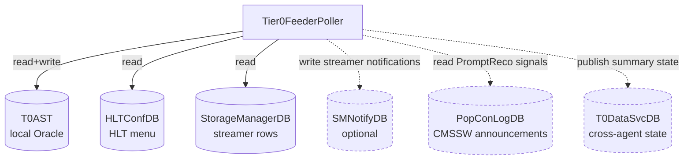

Caption (~150 words): the solid lines are mandatory connections; the dashed lines are conditional on the corresponding `config.<...>Database` block. Foreshadow Chapter 3's reading of the constructor where each block is gated.

**Code excerpts:**

- `src/python/T0/__init__.py:1-8` — the version stamp; annotation: "this is what `pip install T0=={version}` resolves to and what the CI tag/release workflows watch."
- `src/python/T0Component/Tier0Feeder/Tier0Feeder.py:21-50` — the `Harness` subclass; annotation: "the entire role of this file is to register one worker thread; the actual work is in the next file."
- `src/python/T0Component/Tier0Feeder/Tier0FeederPoller.py:38-100` — the constructor showing six DB connections; annotation: each `if hasattr(config, "...Database"):` corresponds to a dashed edge in D1.3.

**Deeper dive (collapsed):** "Why is `T0Auditor` a stub?" — show that the `Tier0Auditor` poller has an empty `algorithm()` body and explain the ops convention of registering a no-op component to reserve the namespace.

**Takeaways (3–6 bullets):**
- T0 is a polling agent built on WMCore's WMAgent framework.
- Two source roots: `T0` (pure libraries) and `T0Component` (harness-wrapped runtime components).
- The processing chain is fixed: Repack → Express → PromptReco → AlcaHarvest → ConditionUpload.
- Six possible Oracle DB connections; only T0AST + HLTConfDB + StorageManagerDB are mandatory.
- Versioning lives in one file: `src/python/T0/__init__.py`.

**Self-check (3–5 questions):**
- "What goes in `T0Component` and what goes in `T0`? Why?"
- "Name the three Oracle DBs Tier0Feeder *must* connect to and what each provides."
- "Where does the Tier0FeederPoller's poll interval come from?"
- "What is the relationship between `Harness`, `BaseWorkerThread`, and `WorkerThreadManager`?"

---

### Task 5: Chapter 2 — The Tier0Config DSL

**Files:**
- Modify: `docs/superpowers/t0-architecture-guide.html` (Chapter 2 sections only)

**Sources to read:**
- `src/python/T0/RunConfig/Tier0Config.py:1-271` (the canonical docstring — this *is* the schema spec)
- `src/python/T0/RunConfig/Tier0Config.py:272-1000` (skim the setters: `createTier0Config`, `addDataset`, `addRepackConfig`, `addExpressConfig`, `addSiteConfig`, `setHelperAgentStreams`, `setInjectRuns`, `specifyStreams`)
- `etc/ReplayOfflineConfiguration.py:1-200` (a real example of the DSL in use)
- `src/python/T0/RunConfig/RunConfigAPI.py` — the `configureRun` and `configureRunStream` functions; use `extract_excerpt.py` to find their actual line ranges (search for `^def configureRun`)
- A few representative DAOs in `src/python/T0/WMBS/Oracle/RunConfig/`: `InsertRun.py`, `InsertStream.py`, `InsertRepackConfig.py`, `InsertDatasetScenario.py`

**Setup prose (~350 words) must cover:**
- The DSL is the *operator entry point*. Operators don't write SQL — they write Python that builds an in-memory `Tier0Config` object, and `configureRun` translates it into T0AST rows.
- The Tier0Config object is essentially a nested config tree; the canonical docstring at the top of `Tier0Config.py` is the schema.
- The pattern: "operator writes setter call → builder mutates the tree → at run discovery time, `configureRun` walks the tree and inserts rows."
- Why it matters: every operational lever (acquisition era, backfill mode, stream-level Repack thresholds, helper-agent splits) flows through this DSL. Reading `etc/ReplayOfflineConfiguration.py` is the fastest way to grasp what T0 actually does in production.

**Diagrams (Mermaid sources):**

- [ ] **D2.1 — Tier0Config object tree** (rendered from the docstring; abbreviated)

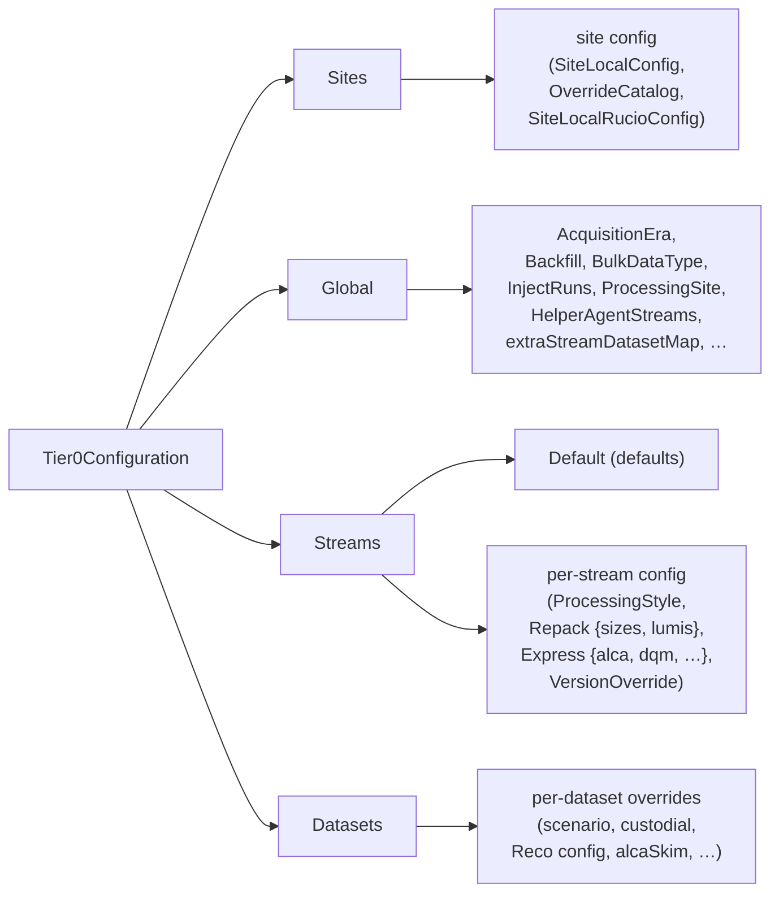

Caption (~180 words): emphasise that this matches the docstring ASCII tree exactly; that `Streams.Default` provides the fallback for any stream not individually configured; that `Datasets` overrides apply on top of stream-level config.

- [ ] **D2.2 — Setter → T0AST table mapping**

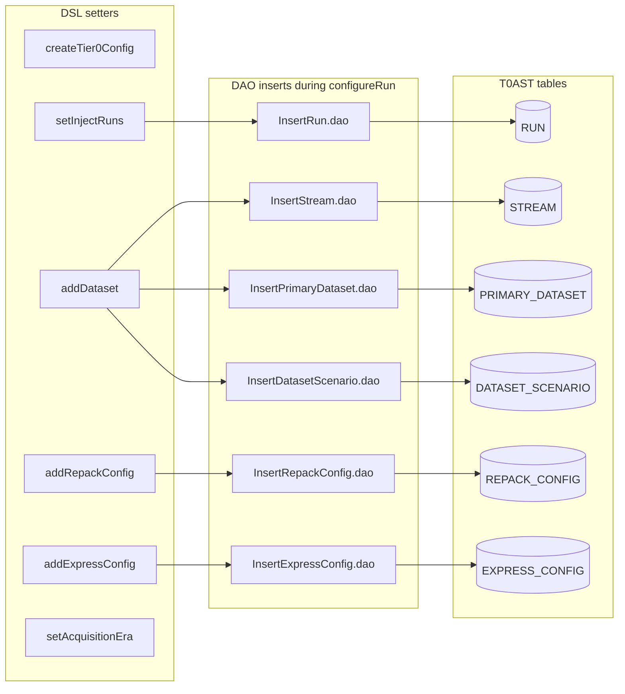

Caption (~180 words): connect this to the previous chapter's claim that "DAOs are one parameterised SQL each"; preview Chapter 3 by noting that `configureRun` is what *invokes* these DAOs.

- [ ] **D2.3 — `configureRun` sequence diagram**

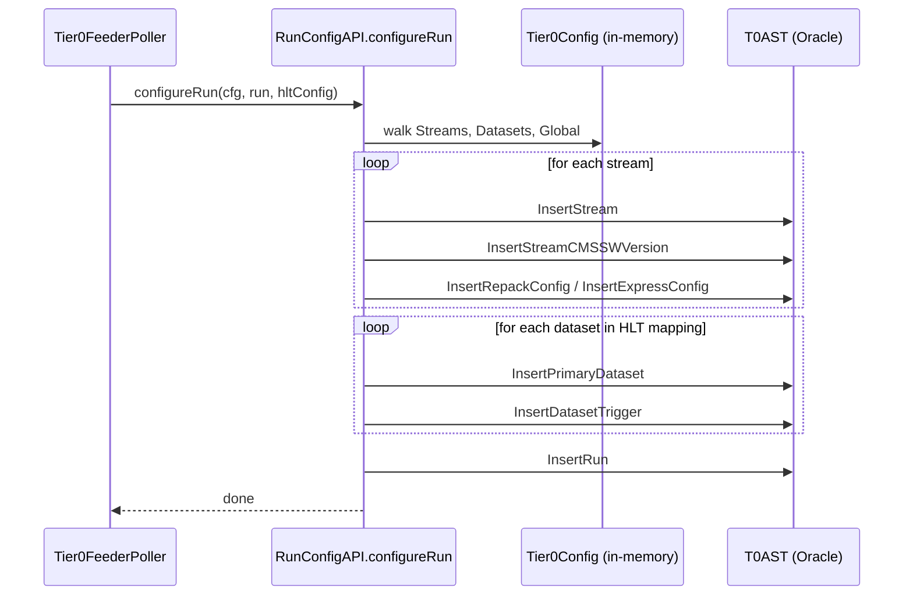

Caption (~150 words): point out that this happens *once per run*, idempotently, when the Tier0Feeder first sees that run via `FindNewRuns`.

**Code excerpts:**

- `src/python/T0/RunConfig/Tier0Config.py:1-100` — first chunk of the docstring; annotation: "the rest of the file is implementation; this header is the schema."
- `etc/ReplayOfflineConfiguration.py:1-50` — imports + `createTier0Config()` + `setInjectRuns(...)` + `setAcquisitionEra(...)`; annotation: "operators only write this Python; nothing else."
- `src/python/T0/RunConfig/Tier0Config.py:272-340` — `createTier0Config()` and `retrieveStreamConfig()`; annotation: "shows how the tree is built — note the `_internal_name` pattern and the dict-backed sections."
- A 30–50 line excerpt from the body of `configureRun` (use `extract_excerpt.py` to find the start, take ~40 lines after the function definition).

**Deeper dive:**
- `<details>`: "extraStreamDatasetMap — when does it apply?" Brief discussion of how the DSL allows post-hoc Stream→Dataset mapping that overrides the HLT menu, and why that's needed for parking PDs.

**Takeaways:**
- The Tier0Config object is built imperatively in Python; it is *not* a static config file.
- The docstring at the top of `Tier0Config.py` is the canonical schema reference. When in doubt, re-read it.
- `configureRun` is the bridge: in-memory tree → SQL inserts → live processing.
- `Streams.Default` is the silent fallback for any stream not individually configured.

**Self-check:**
- "If you call `addRepackConfig(cfg, 'StreamX', maxSizeSingleLumi=…)`, when does that value reach T0AST?"
- "What's the difference between modifying `Streams.Default` and `Streams.StreamX`?"
- "Why does `configureRun` need both the Tier0Config *and* the HLT config?"
- "Name three things the operator can change without touching DAOs or splitter code."

---

### Task 6: Chapter 3 — The Tier0Feeder heartbeat

**Files:**
- Modify: `docs/superpowers/t0-architecture-guide.html` (Chapter 3 sections only)

**Sources to read:**
- `src/python/T0Component/Tier0Feeder/Tier0FeederPoller.py` (full file; identify the body of `algorithm`)
- `src/python/T0Component/Tier0Feeder/MultipleAgents/{BaseAgent.py,MainAgent.py,HelperAgent.py}` (each ~50 lines, all three full)
- 4–5 representative DAOs in `src/python/T0/WMBS/Oracle/Tier0Feeder/`: `FindNewRuns.py`, `FindNewRunStreams.py`, `FeedStreamers.py`, `MarkWorkflowsInjected.py`, `GetDeploymentID.py`. Use `extract_excerpt.py` to inspect each.
- `src/python/T0/WMBS/Oracle/Create.py:1-60` (just the top — show what schema bootstrap looks like)

**Setup prose (~400 words) must cover:**
- This is the heartbeat: every `pollInterval` seconds (default 30), `algorithm()` runs once.
- The four phases of one tick (paraphrasing the file's top docstring): "Checks for new data, populates RunConfig for new runs, sets up subscriptions for new runs/streams, assigns new data to the correct subscriptions."
- Why the same component owns both *configuration* (calling `configureRun*`) and *data flow* (feeding streamers): keeps schema-evolving operations transactionally close to the data inserts they enable.
- The DAO convention: every SQL touch is a class in `T0/WMBS/Oracle/<area>/<Verb><Noun>.py` with `execute(...)` and an SQL string. No raw SQL in the poller.
- The Main/Helper split: introduce the operational use case (one MainAgent + N HelperAgents on different hosts, splitting load by stream lists).

**Diagrams:**

- [ ] **D3.1 — Per-tick flowchart of `algorithm()`**

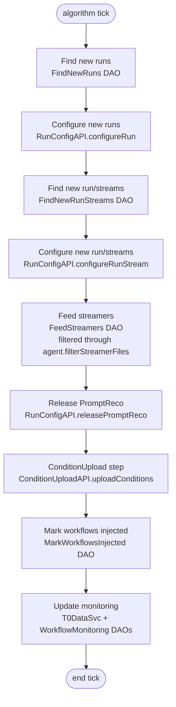

Caption (~180 words): mention this is a simplified view; the actual code has try/except boundaries between phases so a single failed step doesn't stop the next from running on the next tick. Cross-link forward to Chapter 5 for `releasePromptReco` and `uploadConditions`.

- [ ] **D3.2 — DAO call graph for one tick**

```mermaid
graph LR
  Poll[Tier0FeederPoller]
  subgraph Discovery
    F1[FindNewRuns]
    F2[FindNewRunStreams]
    F3[GetExpressReadyRuns *opt*]
  end
  subgraph Inserts via RunConfigAPI
    I1[InsertRun]
    I2[InsertStream]
    I3[InsertRepackConfig]
    I4[InsertExpressConfig]
    I5[InsertPrimaryDataset]
    I6[InsertDatasetScenario]
    I7[InsertEventScenarios]
  end
  subgraph DataFlow
    D1[FeedStreamers]
    D2[MarkWorkflowsInjected]
  end
  subgraph Monitoring
    M1[GetStreamerWorkflowsForMonitoring]
    M2[GetPromptRecoWorkflowsForMonitoring]
    M3[MarkTrackedWorkflowMonitoring]
  end
  Poll --> Discovery
  Poll --> Inserts via RunConfigAPI
  Poll --> DataFlow
  Poll --> Monitoring
```

Caption (~150 words): orient the reader by clusters; foreshadow Chapter 4's dive into how `FeedStreamers` populates the WMBS subscription tables that splitters consume.

- [ ] **D3.3 — Main / Helper agent stream routing**

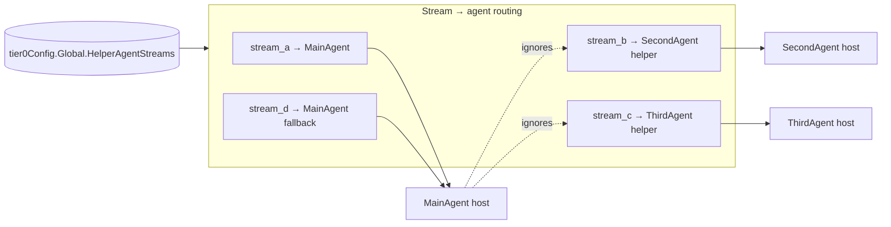

Caption (~180 words): explain that `agentName` in the WMAgent config picks which subclass instantiates; helpers read only their listed streams; main reads everything *not* listed in any helper. Tie to the responsibility split mentioned in the spec — helpers and main use the same DAO/splitter code, just with different filter lists.

**Code excerpts:**

- `Tier0FeederPoller.py` body of `algorithm` — the canonical excerpt of this chapter. Use `extract_excerpt.py` to find the right ~80–120 line range. Annotation: walk the reader through each phase.
- `MultipleAgents/MainAgent.py:1-50` (the full file you saw earlier, ~50 lines).
- `MultipleAgents/HelperAgent.py:1-46` (the full file).
- One Find DAO body, e.g., `FindNewRuns.py` (likely <40 lines) — to show the DAO shape: a class with `sql = """SELECT …"""` and an `execute()` method.
- A snippet from `T0/WMBS/Oracle/Create.py` showing the `CREATE TABLE` for one of the central tables (e.g., `RUN` or `STREAMER`).

**Deeper dive:**
- `<details>`: "What stops Main and Helper from racing on the same row?" Brief mention of the row-level locks/idempotent inserts and the `agentName` partitioning.

**Takeaways:**
- Every tick: Find → Configure → Feed → Mark. Predictable, idempotent.
- All SQL lives in DAOs; the poller is pure Python orchestration.
- The Main/Helper split is configured in the *Tier0Config*, not the WMAgent config — but selected at runtime by the WMAgent config's `agentName`.

**Self-check:**
- "Trace one streamer file from arrival in `STORAGE_MANAGER` to its row in `STREAMER` — which two DAOs touch it?"
- "If a HelperAgent's `agentName` doesn't appear as a key in `tier0Config.Global.HelperAgentStreams`, what happens?"
- "Why is `ReleasePromptReco` invoked from inside `algorithm()` instead of from a separate poller?"
- "Where would you add logging to see how long each phase of one tick takes?"

---

### Task 7: Chapter 4 — JobSplitting

**Files:**
- Modify: `docs/superpowers/t0-architecture-guide.html` (Chapter 4 sections only)

**Sources to read:**
- `src/python/T0/JobSplitting/{Repack.py,RepackMerge.py,Express.py,ExpressMerge.py,Condition.py,AlcaHarvest.py}` (read all six; pay closest attention to `Repack.py` and `Express.py`)
- `src/python/T0/WMBS/Oracle/JobSplitting/{InsertSplitLumis.py,InsertPromptCalibrationFile.py}`
- Concept reference (no code excerpt): `WMCore.JobSplitting.SplitterFactory` — explain its plugin pattern

**Setup prose (~400 words) must cover:**
- A *splitter* takes a WMBS subscription (a fileset + a workflow) and produces *job groups* — concrete units of work HTCondor can run.
- T0 plugs into WMCore's `SplitterFactory(package="T0.JobSplitting")`. Each splitter is a class that subclasses `WMCore.JobSplitting.JobFactory` and implements `algorithm`.
- The four splitter shapes you'll encounter:
  1. **Repack** — size-/lumi-/file-bounded fan-out from raw streamer files.
  2. **RepackMerge** — combines small Repack outputs to hit a target file size for storage.
  3. **Express** — latency-bounded; produces rapid feedback to detector experts.
  4. **ExpressMerge** — usually a no-op or minimal; Express output is rarely merged.
  5. **Condition / AlcaHarvest** — simpler shapes that produce calibration/conditions outputs.
- The shared decision pattern: "wait, split-now, or split-and-leave-some". The thresholds are operator-tunable through the Tier0Config DSL (Chapter 2).

**Diagrams:**

- [ ] **D4.1 — Repack splitter decision tree**

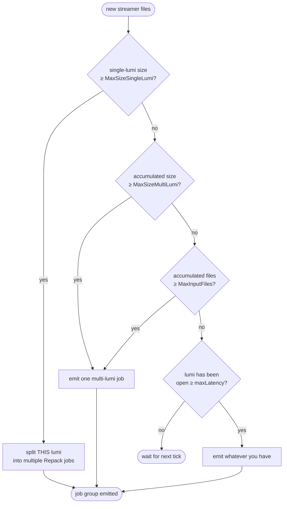

Caption (~180 words): tie each threshold to a DSL setter from Chapter 2; explain that "wait" is an active choice — the splitter returns no jobs and the next tick re-evaluates.

- [ ] **D4.2 — Express splitter decision tree** (latency-driven)

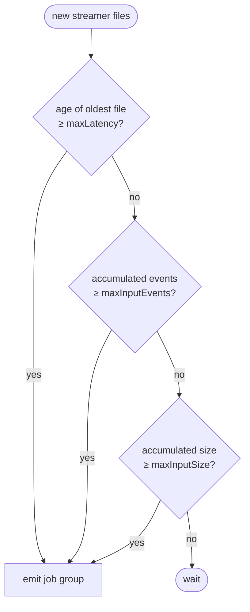

Caption (~150 words): contrast with Repack; Express prioritises low latency over efficient packing.

- [ ] **D4.3 — WMBS job state machine**

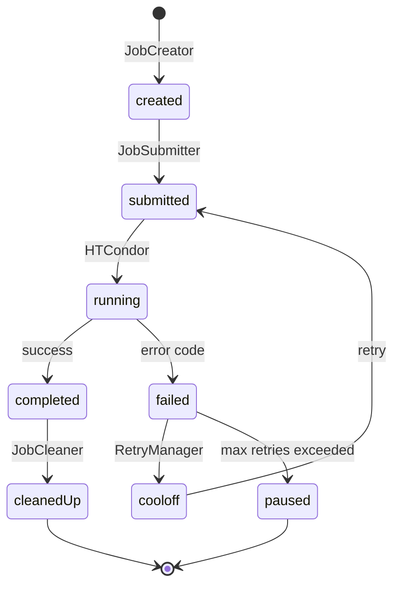

Caption (~150 words): T0's splitters produce jobs in `created`; everything to the right is WMCore. Mention that the T0 retry-config (`PauseAlgo`) is what decides the `paused` exit.

**Code excerpts:**

- A 30–60 line excerpt from `Repack.py` showing the threshold checks (use `extract_excerpt.py`).
- A 30–60 line excerpt from `Express.py` showing the latency check.
- The `algorithm` method signature from one splitter (10–15 lines) — annotation: "every splitter follows this contract."
- `InsertSplitLumis.py` (likely ~30 lines) — annotation: "the bookkeeping a splitter does to record that it has fanned out a single lumi."

**Deeper dive:**
- `<details>`: "Why is RepackMerge a separate splitter instead of a flag on Repack?" Briefly explain the WMCore subscription pattern and how merge subscriptions consume outputs of upstream subscriptions.

**Takeaways:**
- Splitters are pure decision functions over (current state, thresholds) → emitted job groups.
- Repack is size-driven; Express is latency-driven; the rest are simpler.
- All thresholds come from the Tier0Config DSL.

**Self-check:**
- "If `maxLatency = 5 minutes` is set on a Repack stream, what behaviour does that *unlock*?"
- "What's the smallest set of Tier0Config knobs that controls Repack output file size?"
- "Why does Express usually skip the merge step?"
- "Trace a job that fails with a transient error: which states does it visit?"

---

### Task 8: Chapter 5 — Closeout

**Files:**
- Modify: `docs/superpowers/t0-architecture-guide.html` (Chapter 5 sections only)

**Sources to read:**
- `src/python/T0/RunConfig/RunConfigAPI.py` — the body of `releasePromptReco` (use `extract_excerpt.py` to find the function)
- `src/python/T0/JobSplitting/AlcaHarvest.py`
- `src/python/T0/RunLumiCloseout/RunLumiCloseoutAPI.py`
- `src/python/T0/ConditionUpload/{ConditionUploadAPI.py,upload.py}`
- DAOs in `src/python/T0/WMBS/Oracle/RunLumiCloseout/`, `ConditionUpload/`, plus `Tier0Feeder/GetRunDatasetDone.py`, `GetRunDatasetReleased.py`

**Setup prose (~400 words) must cover:**
- "Closeout" is the question "is run N completely done?" answered across multiple subsystems.
- The four subsystems involved:
  1. **PromptReco release** (`RunConfigAPI.releasePromptReco`) — until the CMSSW release for a run is *announced* (signal lives in `PopConLogDB`), PromptReco workflows are deferred. Once announced, the deferred config is converted into live workflows.
  2. **AlcaHarvest** — produces calibration sqlite files; runs once per run/dataset; can be time-triggered via `AlcaHarvestTimeout`.
  3. **ConditionUpload** — uploads sqlite + metadata to the conditions dropbox; respects `ValidationMode` (validation-only vs prompt) and `DropBoxHost`.
  4. **RunLumi closeout** — once every fileset for a run/stream is closed *and* AlcaHarvest is done *and* conditions are uploaded, the run/stream is marked closed-out; eventually archived.
- Why this matters operationally: most "stuck run" tickets land in this layer. Knowing the state model makes triage tractable.

**Diagrams:**

- [ ] **D5.1 — Run closeout state machine**

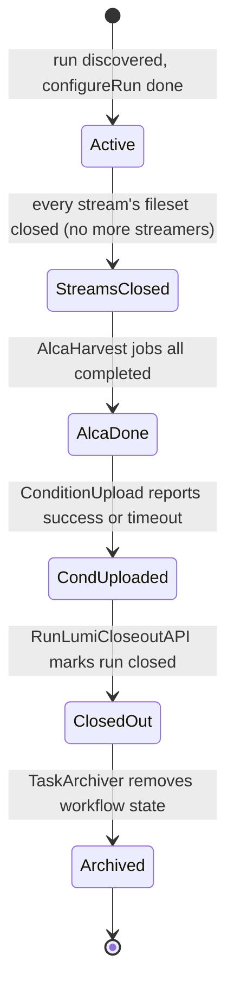

Caption (~180 words): emphasise that the transitions are *decided by polling* — the Tier0Feeder asks each subsystem "are you done?" every tick and only advances when the answer is yes. Tie back to Chapter 3's per-tick flowchart.

- [ ] **D5.2 — ConditionUpload sequence**

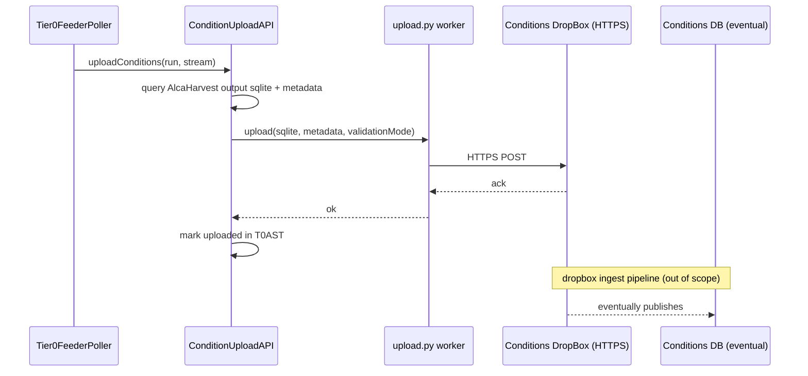

Caption (~150 words): clarify that everything past the dropbox is owned by a different team; the T0 contract ends at "POST returned 200".

- [ ] **D5.3 — Closeout signals and where they originate**

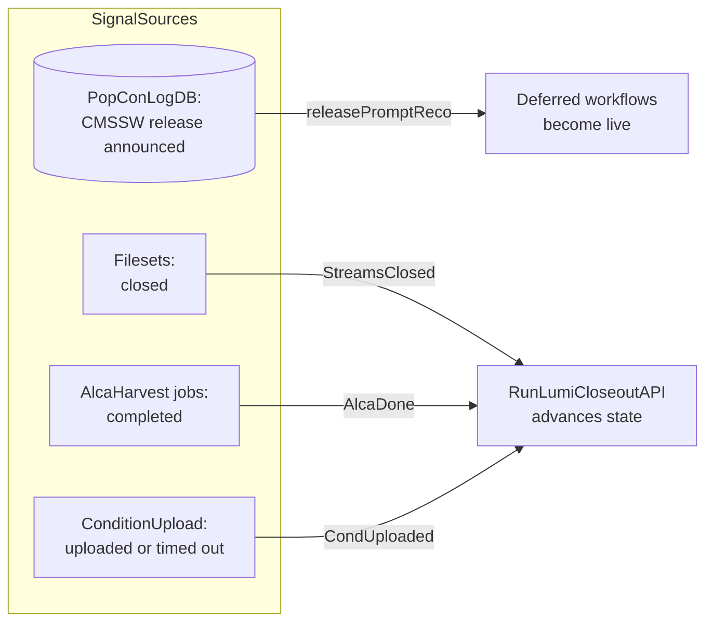

Caption (~150 words): four independent signals, all converging in `RunLumiCloseoutAPI`; if any signal is missing, the run stays in its current state.

**Code excerpts:**

- The body of `RunConfigAPI.releasePromptReco` (~30–60 lines).
- A snippet from `ConditionUpload/ConditionUploadAPI.py` showing the validation-mode branching.
- A snippet from `ConditionUpload/upload.py` showing the actual HTTPS upload (likely `requests` or `urllib`).
- A snippet from `RunLumiCloseoutAPI.py` showing one of the "is this done?" queries.
- One of the closeout DAOs, e.g., `GetRunDatasetDone.py`, to show the SQL shape of "is this run finished?".

**Deeper dive:**
- `<details>`: "What does `AlcaHarvestTimeout` actually do?" Explain the time-trigger fallback for AlcaHarvest when fileset closure is delayed.
- `<details>`: "ValidationMode vs prompt" — the operator-facing implication of the flag.

**Takeaways:**
- Closeout is the convergence of four signals; missing any one stalls the run.
- PromptReco release is *signal-driven* (waits for CMSSW announcement), not time-driven.
- The T0 ↔ Conditions DB contract ends at the dropbox HTTPS POST.

**Self-check:**
- "List the four signals that must arrive before a run is marked closed-out."
- "What's the difference between 'closed-out' and 'archived'?"
- "If a run is stuck at `AlcaDone` for hours, what would you check first?"
- "Why is `releasePromptReco` invoked from `Tier0FeederPoller.algorithm` instead of from PromptReco workflow code?"

---

### Task 9: Chapter 6 — Operator surface and recap

**Files:**
- Modify: `docs/superpowers/t0-architecture-guide.html` (Chapter 6 sections only)

**Sources to read:**
- `bin/00_pypi_deploy_replay.sh`, `bin/00_pypi_deploy_prod.sh`, `bin/00_pypi_start_agent.sh`, `bin/00_pypi_stop_agent.sh`, `bin/00_pypi_patches.sh`, `bin/pypi_update.sh`
- `bin/t0` (the Python operator CLI)
- `.github/workflows/{deployReplayPR.yaml,validate-config.yaml,create_tag_and_release.yaml,pypi_build_publish_template.yaml}`
- Skim everything written in Chapters 1–5 (this chapter ties them together)

**Setup prose (~350 words) must cover:**
- Why the operator surface lives in this repo at all: the deploy hosts pull these scripts directly from `master` (`pypi_update.sh`), so the repo *is* the source of truth for production.
- The deploy script orchestration: `00_pypi_deploy_replay.sh` and `00_pypi_deploy_prod.sh` pin their *own* T0/WMCore versions independent of `__init__.py` (CLAUDE.md flags this drift); `00_pypi_patches.sh` is *live operational state* — it cherry-picks WMCore PRs from contributor forks at deploy time.
- The replay-by-PR-comment workflow: authorised operators trigger replays by commenting on PRs that modify `etc/*ReplayOfflineConfiguration.py`. The workflow's `env:` block is the *defaults* registry; node whitelist + user authorisation live there.
- The CI trio: `validate-config.yaml` (PR gate for ProdOfflineConfiguration), `create_tag_and_release.yaml` (push-to-master tag), `pypi_build_publish_template.yaml` (PyPI publish).

**Diagrams:**

- [ ] **D6.1 — Deploy script call graph**

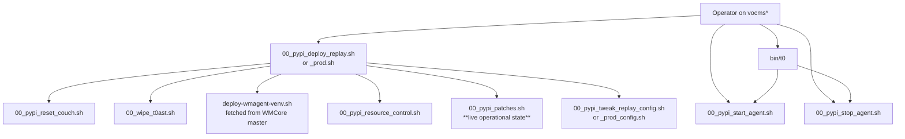

Caption (~180 words): emphasise that `patches.sh` is the *only* file in `bin/` that should be expected to drift between deploys.

- [ ] **D6.2 — Replay-by-PR-comment workflow**

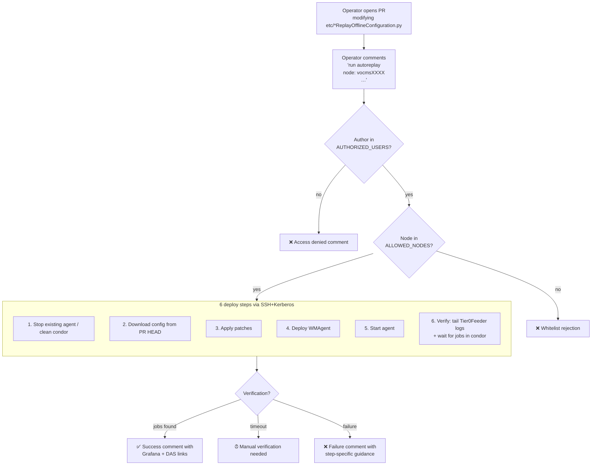

Caption (~200 words): note that this workflow runs on a *self-hosted runner* (`runs-on: cmst0`) with a Kerberos keytab — it can't be reproduced by external forks; the bot identity is `cmst0@CERN.CH`.

- [ ] **D6.3 — Recap mind-map** (everything in one picture)

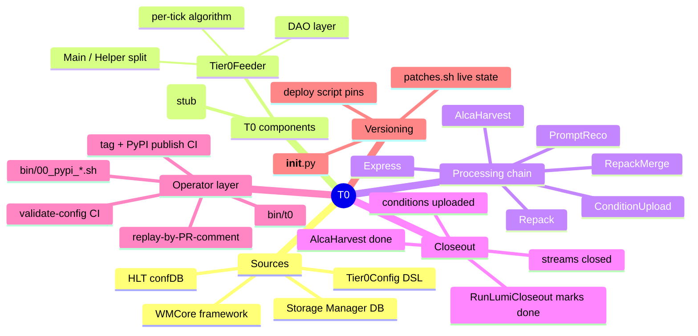

Caption (~200 words): give the reader a one-glance summary of the entire system. Encourage them to test their understanding by trying to *narrate* each branch without re-opening earlier chapters.

**Code excerpts:**

- `bin/00_pypi_deploy_replay.sh:1-60` — the version pins + the high-level orchestration block. Annotation: "the version pins are operationally significant; they drift from `__init__.py`."
- `bin/00_pypi_patches.sh` (full file, likely ~30 lines). Annotation: "this file is *expected* to change between deploys."
- `bin/t0:1-50` — the help message + `start()`/`stop()`. Annotation: "the operator CLI; thin wrapper over `manage` and the deploy scripts."
- `.github/workflows/deployReplayPR.yaml:1-50` — the env block (defaults + AUTHORIZED_USERS + ALLOWED_NODES). Annotation: "this env block is the only registry of who can deploy and where."

**Deeper dive:**
- `<details>`: "Why does the replay workflow run on a self-hosted runner?" — Kerberos keytab + ssh access to vocms*.
- `<details>`: "What happens if `__init__.py` drifts from the deploy-script T0 pin?" — explain the divergence between *published* and *deployed* versions.

**Takeaways:**
- The repo is the source of truth for both code and ops scripts.
- Deploy-script version pins drift from `__init__.py` — always read both.
- The replay-by-PR-comment workflow is the operator UX; the env block is its config registry.

**Self-check:**
- "Where would you change the default node for new replays?"
- "How does `pypi_update.sh` close the loop between this repo and the deploy hosts?"
- "Why does the replay workflow need `runs-on: cmst0` instead of `ubuntu-latest`?"
- "Name three things that would force a redeploy (vs a patch + restart)."
- "Without re-opening earlier chapters: explain the chain Storage Manager → ConditionUpload in your own words." (capstone exercise)

---

### Task 10: Final polish + acceptance pass

**Files:**
- Modify: `docs/superpowers/t0-architecture-guide.html`

- [ ] **Step 1: Run the full verifier**

Run: `python3 docs/superpowers/scripts/verify_guide.py`

Expected output: `OK: guide passes all checks`. If it fails, fix the cited issues before proceeding.

- [ ] **Step 2: Run the unit tests**

Run: `python3 -m unittest discover -s docs/superpowers/scripts -p 'test_verify_guide.py' -v`

Expected: 9 tests pass.

- [ ] **Step 3: Open the guide in a browser**

Manually verify:
- TOC links jump to the right sections.
- Scrolling highlights the active TOC link.
- All 15 Mermaid diagrams render (no "syntax error" overlays).
- All code blocks are syntax-highlighted.
- All `<details>` blocks expand and collapse.
- No errors in the browser console.

- [ ] **Step 4: Add a one-line "how to read this guide" note at the top of `<main>`**

After the existing `<p class="meta">`, insert this block above Chapter 1:

```html
<aside class="how-to-read" style="background: var(--code-bg); padding: 12px 16px; border-radius: 6px; border-left: 3px solid var(--accent);">
  <strong>How to read this guide.</strong> Six chapters, ~5 hours each. Read top to bottom — each chapter assumes the previous ones. Self-check questions at the end of each chapter have no answer key on purpose: if a question stumps you, that's the chapter to re-read.
</aside>
```

- [ ] **Step 5: Re-run the verifier**

Run: `python3 docs/superpowers/scripts/verify_guide.py`

Expected: `OK: guide passes all checks`.

- [ ] **Step 6: Commit**

```bash
git add docs/superpowers/t0-architecture-guide.html
git commit -m "Guide: add how-to-read note and final acceptance pass"
```

---

## Self-review (run by the implementer before declaring done)

1. **Spec coverage.** For each acceptance criterion in the spec (`docs/superpowers/specs/2026-05-07-t0-architecture-guide-design.md`), name the task that satisfies it:
   - HTML opens cleanly → Task 10 step 3.
   - All 15 diagrams render → Task 10 step 3 + verifier diagram count.
   - 6 chapters with 7-section shape → Tasks 4–9; verifier `check_chapter_sections`.
   - Every `file:line` ref correct → verifier `check_excerpt_refs`.
   - TOC anchors correct → verifier `check_toc_anchors`.
   - Reader can answer Ch 3 / Ch 5 self-check unaided → manual review (no automation).
   - File at `docs/superpowers/t0-architecture-guide.html` → Task 0 establishes it.
2. **Placeholder scan.** Search the final HTML for "TODO", "TBD", "FIXME". There should be zero.
3. **Type/identifier consistency.** Each chapter uses exactly the IDs `ch{N}-setup`, `ch{N}-diagrams`, `ch{N}-code`, `ch{N}-deeper-dive`, `ch{N}-takeaways`, `ch{N}-self-check`. The verifier enforces this — but eyeball the final file once.
